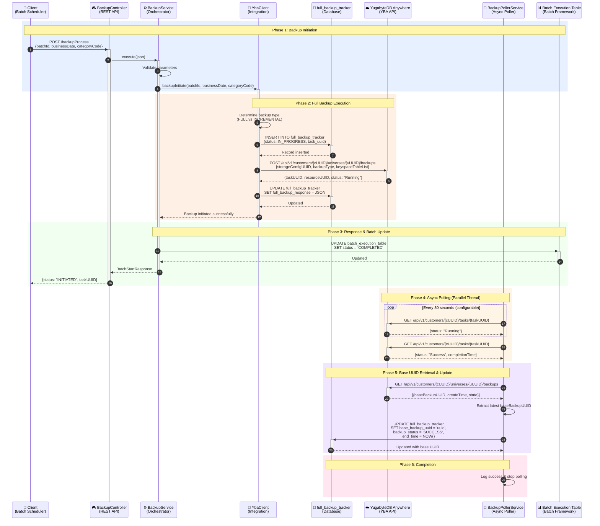
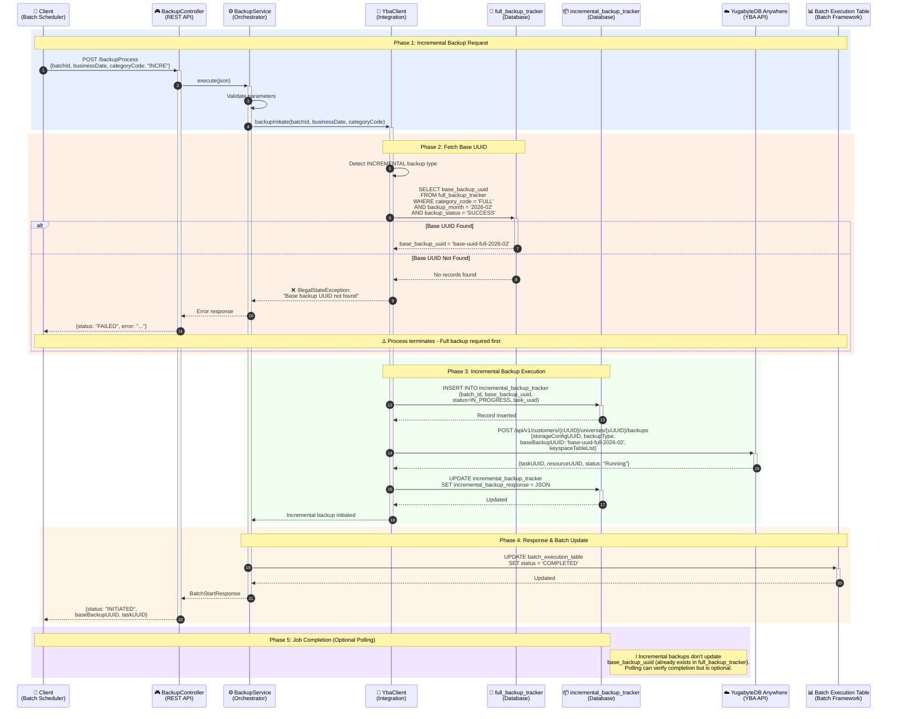

# Backup Orchestrator Service - Visual Diagrams

This document contains all the visual diagrams for the Backup Orchestrator Service architecture, database design, and workflows.

---

## Table of Contents
1. [Full Backup Sequence Diagram](#1-full-backup-sequence-diagram)
2. [Incremental Backup Sequence Diagram](#2-incremental-backup-sequence-diagram)
3. [Three-Table Architecture Flow](#3-three-table-architecture-flow)
4. [Backup Lifecycle State Diagram](#4-backup-lifecycle-state-diagram)
5. [Enhanced ER Diagram](#5-enhanced-er-diagram)
6. [Detailed Database Schema with Constraints](#6-detailed-database-schema-with-constraints)
7. [Database Operations Flow](#7-database-operations-flow)

---

## 1. Full Backup Sequence Diagram

Shows the complete flow of a full backup operation with 6 color-coded phases.

**Key Phases:**
- 🔵 **Phase 1**: Backup Initiation - Request received and validated
- 🟠 **Phase 2**: Full Backup Execution - YBA API called, tracker updated
- 🟢 **Phase 3**: Response & Batch Update - Batch framework updated
- 🟡 **Phase 4**: Async Polling - Parallel thread monitors job status
- 🟣 **Phase 5**: Base UUID Retrieval - Critical for incremental backups
- 🔴 **Phase 6**: Completion - Polling stopped

---

## 2. Incremental Backup Sequence Diagram

Shows the incremental backup flow with base UUID dependency and error handling.

**Key Features:**
- ✅ Fetches base UUID from full_backup_tracker
- ❌ Error handling when base UUID not found
- ✅ Stores base_backup_uuid reference in incremental_backup_tracker
- ✅ No polling needed for base UUID (already exists)

---

## 3. Three-Table Architecture Flow

