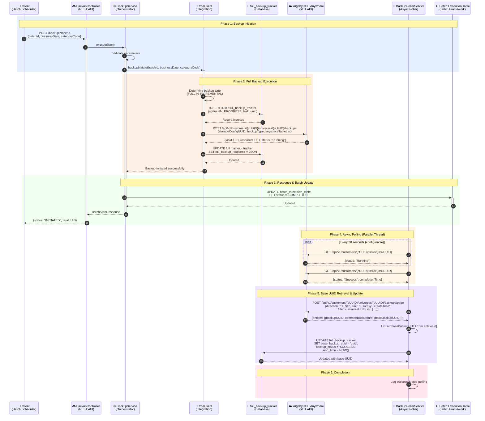
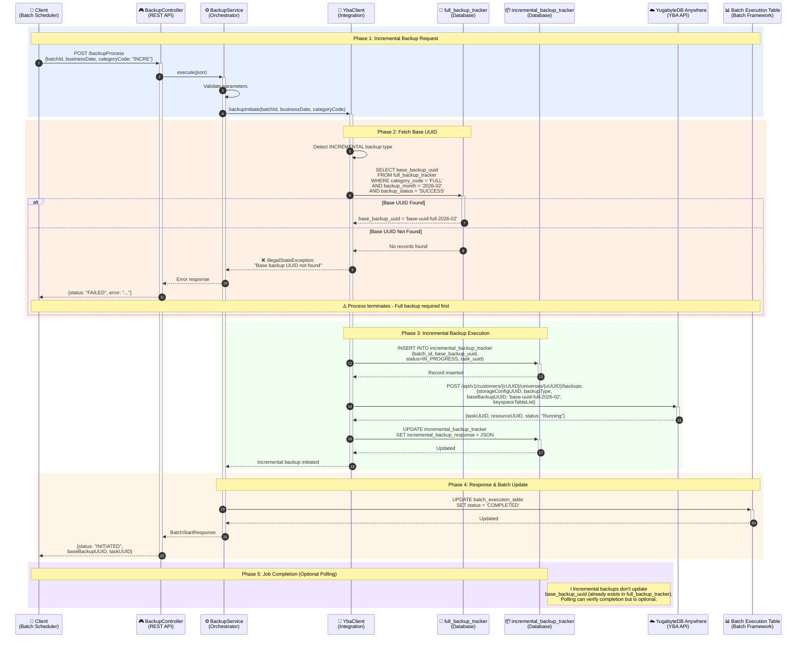
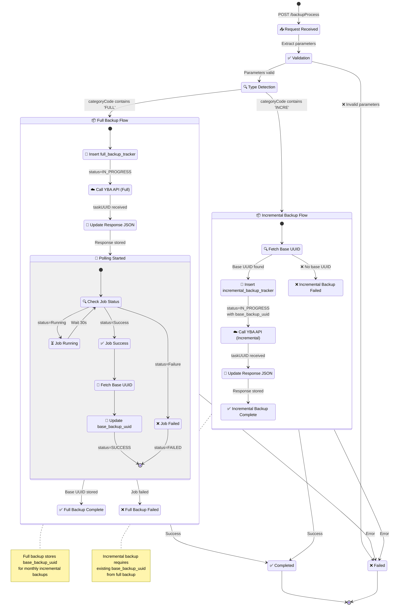
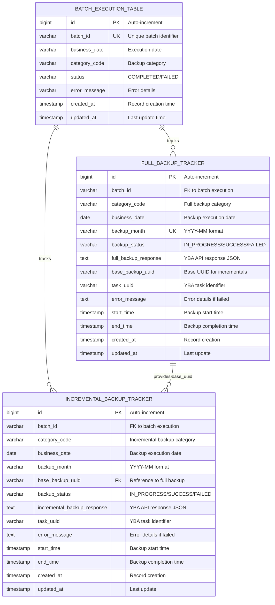
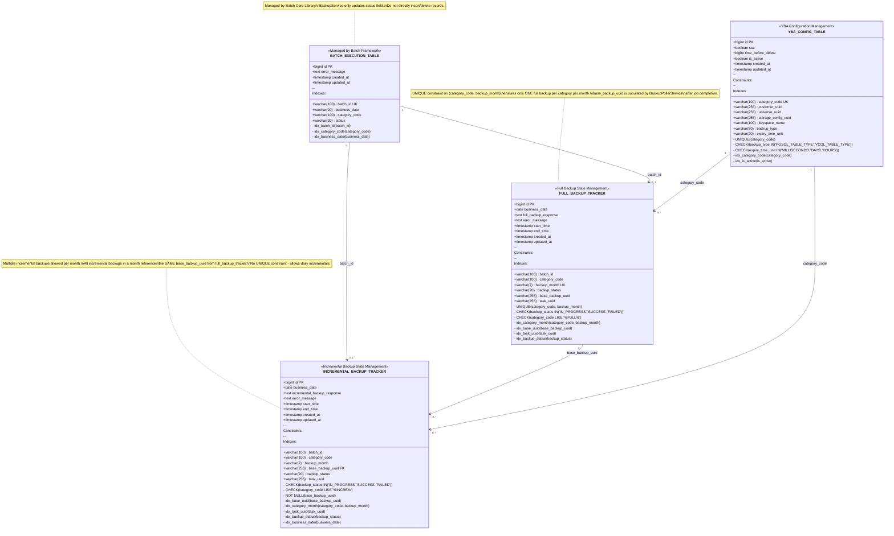
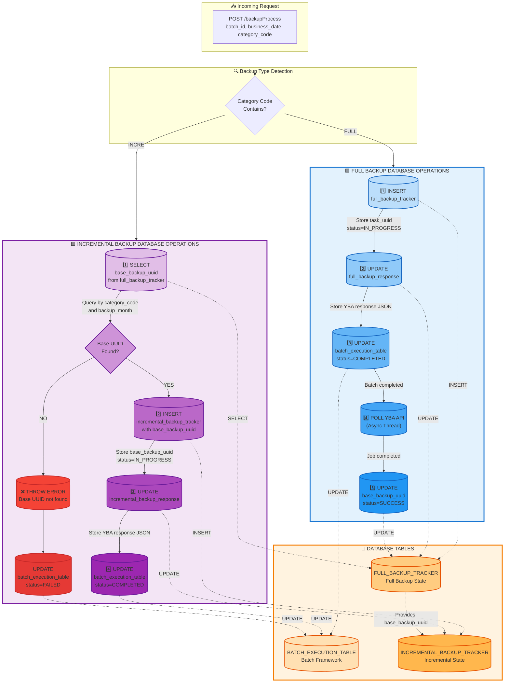

# Backup Orchestrator Service - Visual Diagrams

This document contains all the visual diagrams for the Backup Orchestrator Service architecture, database design, and workflows.

---

## Table of Contents
1. [Full Backup Sequence Diagram](#1-full-backup-sequence-diagram)
2. [Incremental Backup Sequence Diagram](#2-incremental-backup-sequence-diagram)
3. [Three-Table Architecture Flow](#3-three-table-architecture-flow)
4. [Backup Lifecycle State Diagram](#4-backup-lifecycle-state-diagram)
5. [Enhanced ER Diagram](#5-enhanced-er-diagram)
6. [Detailed Database Schema with Constraints](#6-detailed-database-schema-with-constraints)
7. [Database Operations Flow](#7-database-operations-flow)

---

## 1. Full Backup Sequence Diagram

Shows the complete flow of a full backup operation with 6 color-coded phases.



**Key Phases:**
- 🔵 **Phase 1**: Backup Initiation - Request received and validated
- 🟠 **Phase 2**: Full Backup Execution - YBA API called, tracker updated
- 🟢 **Phase 3**: Response & Batch Update - Batch framework updated
- 🟡 **Phase 4**: Async Polling - Parallel thread monitors job status
- 🟣 **Phase 5**: Base UUID Retrieval - Critical for incremental backups
- 🔴 **Phase 6**: Completion - Polling stopped

---

## 2. Incremental Backup Sequence Diagram

Shows the incremental backup flow with base UUID dependency and error handling.



**Key Features:**
- ✅ Fetches base UUID from full_backup_tracker
- ❌ Error handling when base UUID not found
- ✅ Stores base_backup_uuid reference in incremental_backup_tracker
- ✅ No polling needed for base UUID (already exists)

---

## 3. Three-Table Architecture Flow

Overall system architecture showing all layers and database interactions.

```mermaid
graph TB
    subgraph Client["📱 Client Layer"]
        BS[Batch Scheduler]
    end

    subgraph API["🎮 REST API Layer (Port 8989)"]
        BC[BackupController<br/>/backupProcess]
    end

    subgraph Service["⚙️ Service Layer"]
        BKS[BackupService<br/>Orchestrator]
        YCS[YbaConfigService<br/>Config Management]
        VS[ValidationService<br/>Parameter Validation]
        BPS[BackupPollerService<br/>Async Polling Thread]
    end

    subgraph Integration["🔌 Integration Layer"]
        YC[YbaClient<br/>WebClient Integration]
        BDS[BackupDaoService<br/>JDBC Operations]
    end

    subgraph Database["💾 YugabyteDB - Tracking Database"]
        BET[(Batch Execution Table<br/>Managed by Batch Framework)]
        FBT[(full_backup_tracker<br/>Full Backup State + Base UUID)]
        IBT[(incremental_backup_tracker<br/>Incremental Backup State)]
    end

    subgraph External["☁️ External System"]
        YBA[YugabyteDB Anywhere<br/>REST API]
    end

    BS -->|1. POST Request<br/>JSON Payload| BC
    BC -->|2. execute| BKS
    BKS -->|3. Validate| VS
    BKS -->|4. Get Config| YCS
    BKS -->|5. backupInitiate| YC

    YC -->|6a. INSERT<br/>status=IN_PROGRESS| FBT
    YC -->|6b. INSERT<br/>status=IN_PROGRESS| IBT
    YC -->|7. POST /backups<br/>Initiate Backup| YBA
    YBA -->|8. taskUUID<br/>resourceUUID| YC
    YC -->|9a. UPDATE<br/>full_backup_response| FBT
    YC -->|9b. UPDATE<br/>incremental_backup_response| IBT

    YC -->|10. Return Success| BKS
    BKS -->|11. UPDATE<br/>status=COMPLETED| BET
    BKS -->|12. Response| BC
    BC -->|13. JSON Response| BS

    BPS -.->|14. Poll Job Status<br/>GET /tasks/{taskUUID}| YBA
    YBA -.->|15. Job Status| BPS
    BPS -.->|16. POST /backups/page<br/>Fetch Base UUID (Paginated)| YBA
    YBA -.->|17. {entities: [baseBackupUUID]}| BPS
    BPS -.->|18. UPDATE<br/>base_backup_uuid<br/>status=SUCCESS| FBT

    style BET fill:#e1f5ff,stroke:#0288d1,stroke-width:3px
    style FBT fill:#fff3e0,stroke:#f57c00,stroke-width:3px
    style IBT fill:#f3e5f5,stroke:#7b1fa2,stroke-width:3px
    style YBA fill:#e8f5e9,stroke:#388e3c,stroke-width:3px
    style BPS fill:#fff9c4,stroke:#f9a825,stroke-width:3px
    style YC fill:#fce4ec,stroke:#c2185b,stroke-width:3px
    style BKS fill:#e0f2f1,stroke:#00796b,stroke-width:3px
```

**Flow Steps:**
1. Client sends POST request with batch parameters
2. Controller delegates to BackupService
3. Validation of parameters
4. Configuration retrieval from YbaConfigService
5. YbaClient initiates backup
6. Database insert (full or incremental tracker)
7. YBA API call to initiate backup
8. YBA returns task UUID
9. Update tracker with response JSON
10. Return success to service
11. Update batch execution table
12. Return response to controller
13. JSON response to client
14-18. **Async polling** (dotted lines) - runs in parallel thread

**Color Legend:**
- 🔵 Blue: Batch Execution Table
- 🟠 Orange: Full Backup Tracker
- 🟣 Purple: Incremental Backup Tracker
- 🟢 Green: YBA External System
- 🟡 Yellow: Async Poller Service
- 🔴 Pink: YbaClient Integration
- 🟢 Teal: BackupService Orchestrator

---

## 4. Backup Lifecycle State Diagram

State machine showing backup lifecycle from request to completion.



**State Transitions:**
- ✅ Request → Validation → Type Detection
- 🔵 Full Flow: Insert → Call YBA → Update → Poll → Update Base UUID
- 🟣 Incremental Flow: Fetch Base UUID → Insert → Call YBA → Update
- ❌ Error paths for validation failures and missing base UUID

---

## 5. Enhanced ER Diagram

Traditional entity-relationship diagram with all tables and relationships.



**Relationships:**
- BATCH_EXECUTION_TABLE (1) → (0..many) FULL_BACKUP_TRACKER
- BATCH_EXECUTION_TABLE (1) → (0..many) INCREMENTAL_BACKUP_TRACKER
- FULL_BACKUP_TRACKER (1) → (0..many) INCREMENTAL_BACKUP_TRACKER

---

## 6. Detailed Database Schema with Constraints

Class diagram style showing all constraints, indexes, and field specifications.



**Key Constraints:**
- ✅ **UNIQUE(category_code, backup_month)** on full_backup_tracker
- ✅ **CHECK** constraints for status values and category codes
- ✅ **NOT NULL** on base_backup_uuid in incremental_backup_tracker
- ✅ Multiple indexes for query performance optimization

**Important Notes:**
1. **full_backup_tracker**: Only one full backup per category per month (UNIQUE constraint)
2. **incremental_backup_tracker**: Multiple incrementals allowed (no UNIQUE constraint)
3. **batch_execution_table**: Managed by batch framework, service only updates status

---

## 7. Database Operations Flow

Visual flow showing database operations for full vs incremental backups.



**Database Operations:**

**Full Backup (Blue):**
1. INSERT into full_backup_tracker (status=IN_PROGRESS)
2. UPDATE full_backup_response (YBA API response)
3. UPDATE batch_execution_table (status=COMPLETED)
4. POLL YBA API (async thread)
5. UPDATE base_backup_uuid and status=SUCCESS

**Incremental Backup (Purple):**
1. SELECT base_backup_uuid from full_backup_tracker
2. Check if base UUID found
3. INSERT into incremental_backup_tracker (with base_backup_uuid)
4. UPDATE incremental_backup_response (YBA API response)
5. UPDATE batch_execution_table (status=COMPLETED)
6-7. Error path: THROW ERROR and UPDATE batch_execution_table (status=FAILED)

**Color Legend:**
- 🔵 Blue: Full backup operations
- 🟣 Purple: Incremental backup operations
- 🟠 Orange: Database tables
- 🔴 Red: Error handling

---

## Summary

This document contains **7 comprehensive diagrams** covering:

1. ✅ **Full Backup Sequence** - Complete flow with 6 phases
2. ✅ **Incremental Backup Sequence** - With error handling
3. ✅ **Architecture Flow** - 18-step numbered flow
4. ✅ **State Diagram** - Lifecycle state machine
5. ✅ **ER Diagram** - Traditional entity relationships
6. ✅ **Detailed Schema** - With constraints and indexes
7. ✅ **Operations Flow** - Database operations comparison

**Usage:**
- Copy any diagram code block into a Mermaid-compatible viewer
- Use in documentation, presentations, or design reviews
- Reference for development and troubleshooting

**Tools to View Diagrams:**
- Mermaid Live Editor: https://mermaid.live
- GitHub/GitLab (native support)
- VS Code with Mermaid extension
- Confluence with Mermaid plugin
- Draw.io with Mermaid import

---

**Document Version:** 1.0
**Last Updated:** 2026-02-06
**Author:** Backup Orchestrator Service Team

