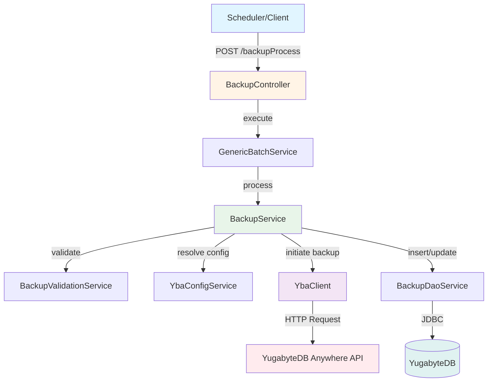
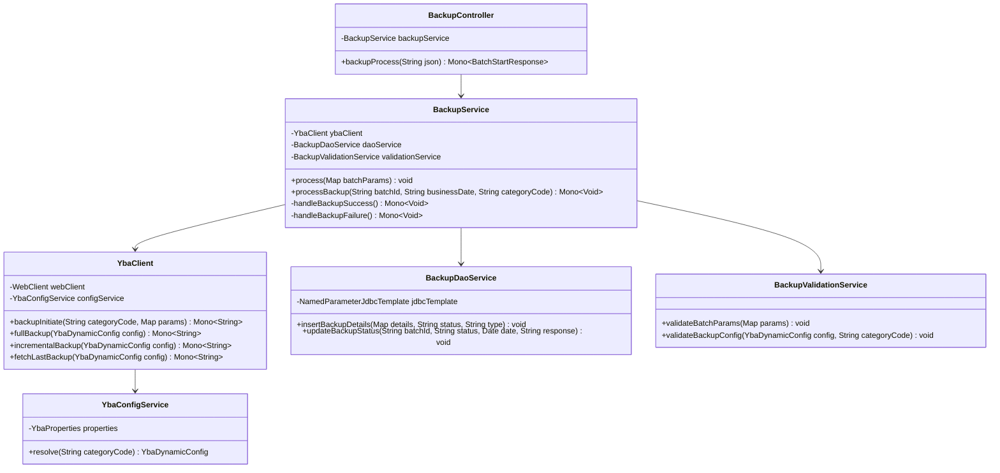
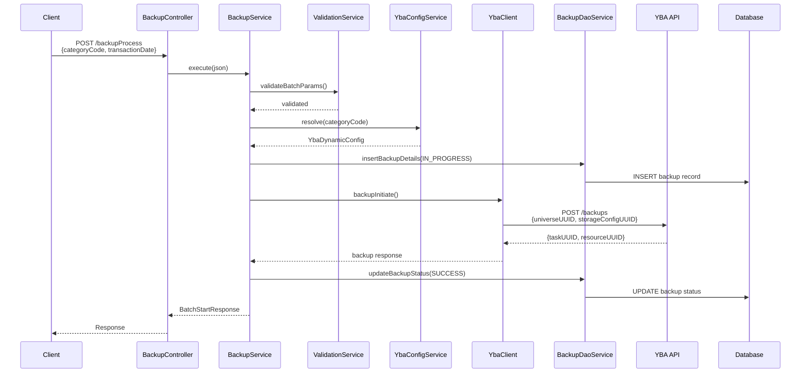
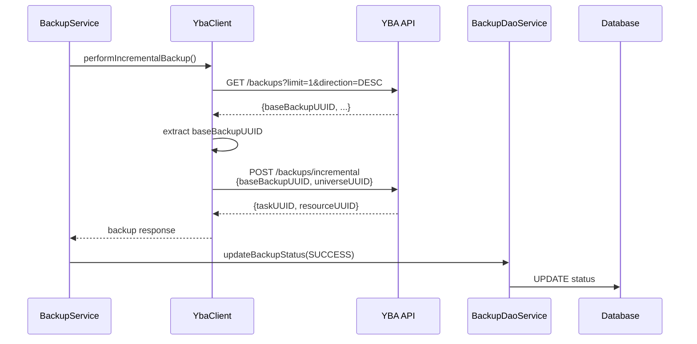
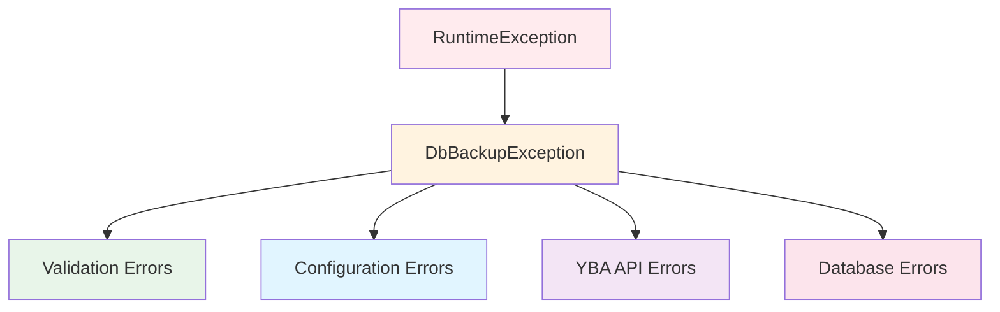
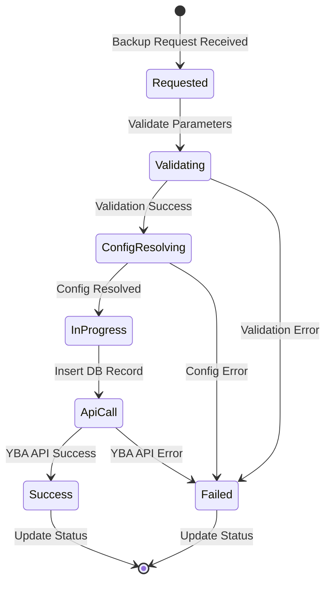
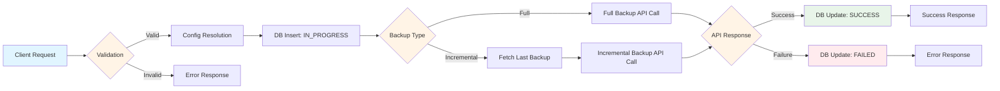

# Backup Orchestrator Service - Architecture Diagrams

This document contains visual diagrams for the Backup Orchestrator Service architecture and workflows.

## 1. High-Level Architecture

## 2. Component Class Diagram

## 3. Full Backup Sequence Diagram

## 4. Incremental Backup Sequence Diagram

## 5. Error Handling Flow

## 6. Backup State Machine

## 7. Data Flow Diagram

